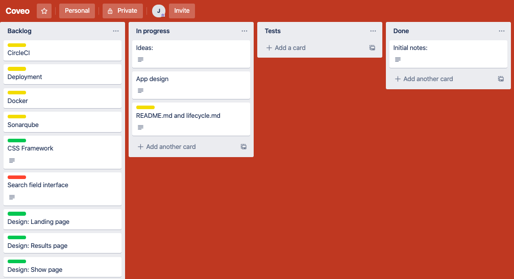
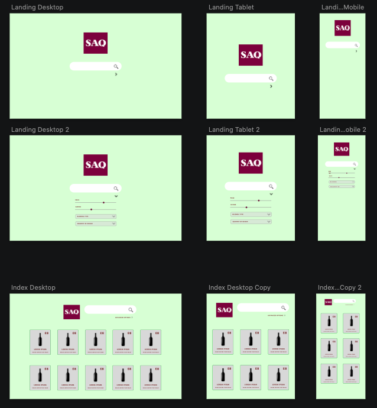
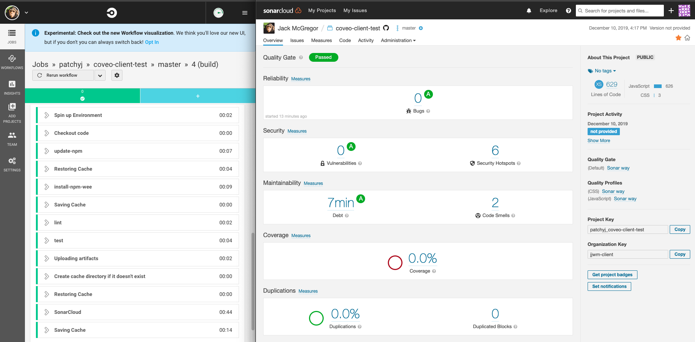
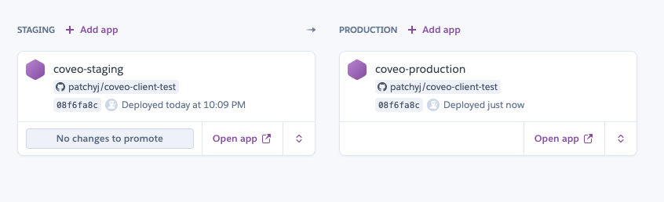

# Method

## 0. Pre-setup

Like any project, no matter how small, getting organised is key. I like to use Trello writing up and breaking down tasks across a friendly Kanban UI and Sketch for wireframing. The more time spent planning code is less time wasted coding.

### My initial Trello board:

### My initial Trello board:

---

## 1. Project setup

Setting up this project was done in 3 stages:

- Folder set up
  - I like to use [React Slingshot](https://github.com/coryhouse/react-slingshot) for a basis as I like how it comes set up with configurable Webpack, Redux and CSS post-processing. I immediately strip out all the parts not needed
- Pipeline set up
  - To keep it simple, this project is using the free versions of [CircleCI](https://circleci.com/) and [Sonarqube](https://sonarcloud.io/), which don't require much configuration and can plug straight into Github
  - Github itself has the Master branch protected with only Pull Requests from non-protected branches onto Master allowed
  - CircleCI (tests / lint / code quality) is configured to pass before merging
- Initial deployment
  - For speed, ease and cost, this app uses Heroku and builds the master branch using the Docker image.
  - Heroku has also been configured with a pipeline with two apps: Staging and Production. Annoyingly, you can't promote code from one to the other if the apps are configured to deploy using Docker. I've kept the steps in, however, deploying each manually with unique branches: `staging` and `master`

### CircleCI and SonarCloud Dashboards

### Heroku Pipeline

